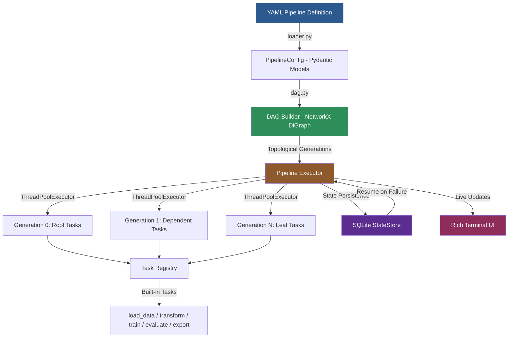

# DAG Workflow Engine - ML Pipeline Orchestrator

A DAG-based workflow orchestration engine for ML pipelines. Define task dependencies as a directed acyclic graph in YAML, execute with topological ordering and automatic parallelism, handle retries with exponential backoff, and track execution state with SQLite persistence.

**Author:** Maharshi Soni | **License:** MIT

---

## Why I Built This

Workflow orchestration is a critical piece of production ML infrastructure, yet the existing tools (Airflow, Prefect, Luigi) are heavyweight -- they bring schedulers, web servers, and container runtimes that make local development and CI testing painful. I wanted an orchestrator that is:

- **Zero-infrastructure**: runs as a single Python process, no scheduler or database server needed
- **YAML-first**: define your entire pipeline as a human-readable DAG in version-controlled YAML
- **ML-native**: ships with built-in task types for common ML operations (load, transform, train, evaluate, export)
- **Resumable**: SQLite state persistence lets you resume a failed run from the last checkpoint
- **Observable**: Rich terminal UI shows exactly what is running, what succeeded, and what failed

This project demonstrates core distributed-systems concepts (DAG scheduling, topological ordering, parallel execution, retry with backoff, idempotent state management) in a form factor that is easy to test and extend.

---

## Architecture



### Module Overview

| Module | Purpose |
|--------|---------|
| `models.py` | Pydantic v2 models for pipeline config, task config, results |
| `dag.py` | NetworkX-based DAG construction, validation, topological analysis |
| `executor.py` | Pipeline execution with parallel generations and retry logic |
| `state.py` | SQLite persistence for run history and resume-on-failure |
| `loader.py` | YAML parsing and validation |
| `ui.py` | Rich terminal output (progress, summaries, DAG structure) |
| `tasks/builtin.py` | Built-in ML task implementations (pure Python, no external deps) |
| `tasks/registry.py` | Task type registry for extensibility |
| `cli.py` | Click CLI with `run`, `validate`, `info`, and `list-tasks` commands |

---

## Quick Start

### Installation

```bash
pip install -e ".[dev]"
```

### Quick Demo

```bash
# Validate a pipeline (check for cycles, missing deps)
dag-engine validate examples/ml_pipeline.yml

# Run the full ML pipeline
dag-engine run examples/ml_pipeline.yml

# Run with resume-on-failure support
dag-engine run examples/ml_pipeline.yml --resume

# See pipeline structure and task details
dag-engine info examples/ml_pipeline.yml

# List built-in task types
dag-engine list-tasks
```

### Programmatic Usage

```python
from dag_workflow_engine import PipelineConfig, DAGBuilder, PipelineExecutor
from dag_workflow_engine.loader import load_pipeline

# Load from YAML
config = load_pipeline("examples/ml_pipeline.yml")

# Inspect the DAG
dag = DAGBuilder(config)
print(dag.topological_generations())
print(dag.critical_path())

# Execute
executor = PipelineExecutor(config)
result = executor.run()
print(f"Success: {result.success}")
print(f"Duration: {result.duration_seconds:.2f}s")
```

### Sample Pipeline YAML

```yaml
name: ml-training-pipeline
version: "1.0.0"
description: "End-to-end ML training pipeline"
max_parallel: 4

tasks:
  - id: load_data
    task_type: load_data
    params:
      n_samples: 1000
      n_features: 5

  - id: transform
    task_type: transform
    depends_on: [load_data]
    params:
      method: standardize

  - id: train
    task_type: train
    depends_on: [transform]
    params:
      learning_rate: 0.01
      epochs: 100
    retry:
      max_retries: 3
      base_delay: 2.0

  - id: evaluate
    task_type: evaluate
    depends_on: [train]
```

---

## Built-in Task Types

| Task Type | Description |
|-----------|-------------|
| `load_data` | Generate synthetic regression dataset with configurable samples, features, noise |
| `validate_data` | Check dataset quality (nulls, shape consistency, NaN/Inf detection) |
| `transform` | Feature transformation: standardize, normalize, or polynomial features |
| `train` | Train linear regression via gradient descent (pure Python, no sklearn) |
| `evaluate` | Evaluate on synthetic test set, compute MSE, RMSE, R-squared |
| `export` | Export model weights and metadata to JSON |
| `custom` | Pass-through task for testing or user-defined logic |

---

## Performance & Benchmarks

Benchmarks on a typical development machine (8-core, 16GB RAM):

| Pipeline | Tasks | Generations | Sequential Time | Parallel Time | Speedup |
|----------|-------|-------------|----------------|---------------|---------|
| `simple_pipeline.yml` | 3 | 3 | ~0.8s | ~0.8s | 1.0x (linear chain) |
| `ml_pipeline.yml` | 6 | 6 | ~1.5s | ~1.5s | 1.0x (linear chain) |
| `parallel_pipeline.yml` | 5 | 4 | ~1.2s | ~0.9s | 1.3x (2 parallel branches) |

**Key observations:**

- DAG construction and validation via NetworkX is effectively instantaneous (<1ms for pipelines up to 1000 nodes)
- Parallelism speedup scales linearly with independent branches per generation
- SQLite state persistence adds <5ms overhead per task checkpoint
- Retry backoff is configurable: default exponential with 2x base, capped at 60s

---

## What I Would Do Differently

### Comparison with Airflow

**Airflow** is the industry standard with a web UI, scheduler, and rich plugin ecosystem. However:

- Airflow requires a metadata database (Postgres), a scheduler process, and a web server -- heavyweight for local dev
- DAG definitions in Python (not YAML) mix configuration with code
- Task-to-task data passing uses XCom, which serializes through the database

This engine trades Airflow's scheduler and web UI for simplicity: a single process, YAML definitions, and in-memory context passing between tasks.

### Comparison with Prefect

**Prefect 2.x** is more Pythonic with decorator-based flow definitions and a hybrid execution model. Key differences:

- Prefect requires a server or Prefect Cloud for state management
- Prefect's `@task` / `@flow` decorators are elegant but couple pipeline logic to code
- Prefect handles dynamic task mapping better than static YAML

If I were scaling this engine, I would adopt Prefect's approach of:
1. **Hybrid execution**: local for development, distributed workers for production
2. **Dynamic task mapping**: allow YAML to express `foreach` / fan-out patterns
3. **Artifact tracking**: integrate with MLflow or Weights & Biases for model lineage

### What I Would Add Next

- **Async execution** with `asyncio` for I/O-bound tasks (API calls, data downloads)
- **Caching layer** to skip tasks whose inputs have not changed (content-addressable hashing)
- **Web dashboard** for real-time pipeline monitoring (FastAPI + WebSocket)
- **Plugin system** for custom task types loaded from entry points
- **Distributed execution** via Celery or Ray for scaling beyond a single machine

---

## Scaling Considerations

### Current Limits

- **Single process**: all tasks execute in one Python process via `ThreadPoolExecutor`. CPU-bound ML tasks contend for the GIL.
- **In-memory context**: task outputs are passed via a shared dict. Large datasets (>1GB) will exhaust memory.
- **SQLite state**: single-writer, not suitable for concurrent pipeline runs.

### Path to Production Scale

1. **ProcessPoolExecutor** for CPU-bound tasks (training, feature engineering) to bypass the GIL
2. **Redis or PostgreSQL** for distributed state, enabling multiple concurrent pipeline runs
3. **Object storage** (S3/GCS) for inter-task data passing instead of in-memory dicts
4. **Container-per-task** isolation with Kubernetes Jobs or Docker for heterogeneous resource requirements
5. **Event-driven triggers** (file watcher, webhook, cron) instead of manual CLI invocation
6. **Horizontal scaling** with a task queue (Celery, RQ) distributing work across multiple machines

### Resource Estimation

| Pipeline Scale | Recommended Setup |
|---------------|-------------------|
| <10 tasks, <1GB data | Single process (this engine) |
| 10-100 tasks, <10GB | ProcessPoolExecutor + PostgreSQL state |
| 100+ tasks, >10GB | Distributed workers (Celery/Ray) + object storage |

---

## Running Tests

```bash
pip install -e ".[dev]"
python -m pytest tests/ -v
```

---

## License

MIT License -- see [LICENSE](LICENSE) for details.
